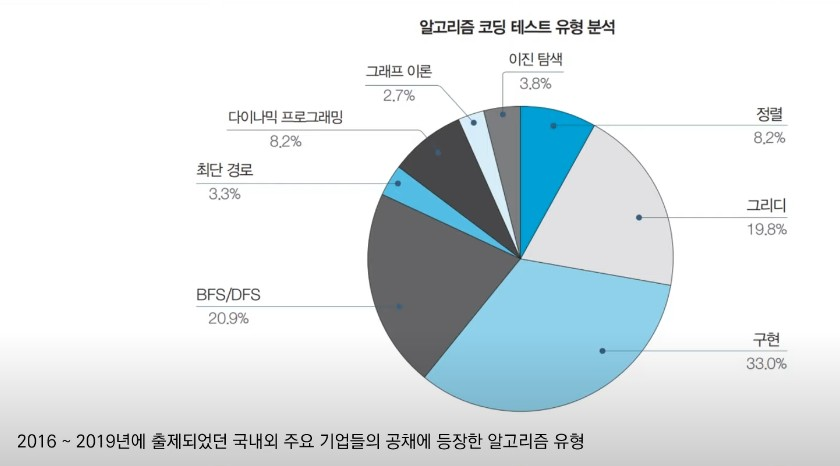
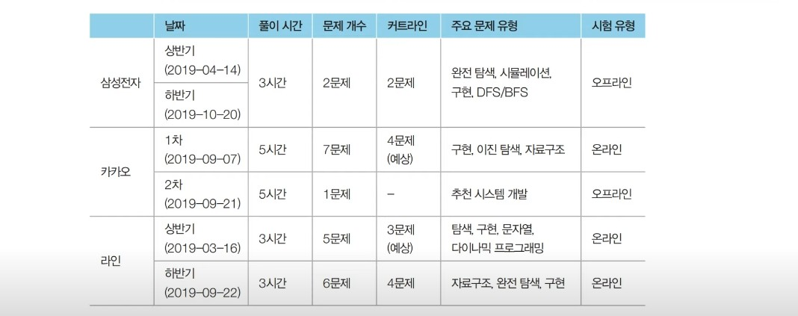
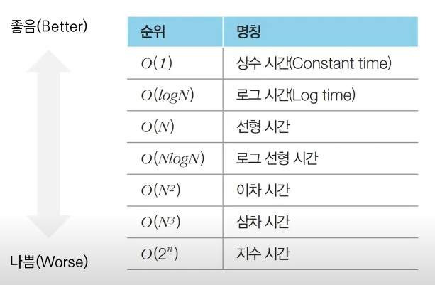
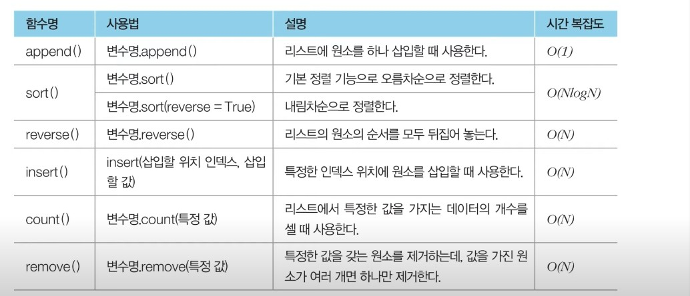
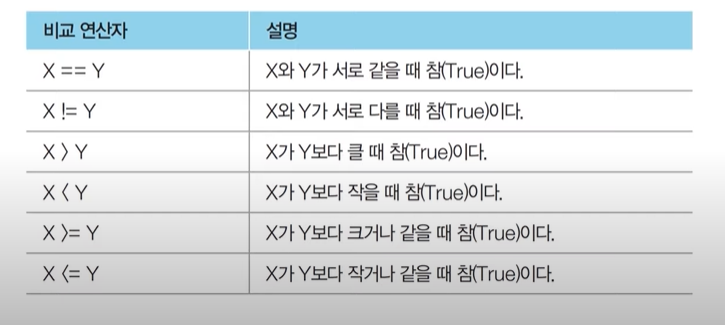
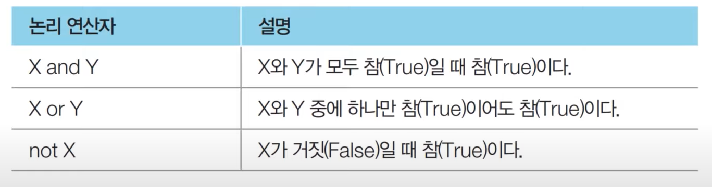
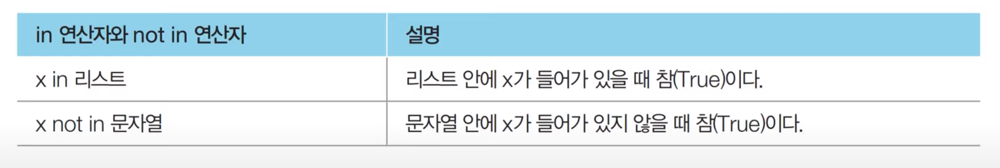
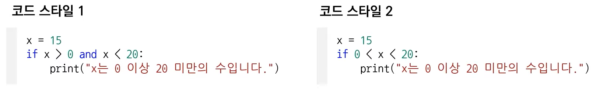

# 코딩테스트를 위한 자료공간

## IT 기업 코딩 테스트 최신 출제 경향

- 그리디(쉬운 난이도)
- 구현
- DFS/BFS 를 활용한 탐색

</img>
</img>

## 복잡도(Complexity)

- 복잡도는 알고리즘의 성능을 나타내는 척도입니다.
    - 시간 복잡도: 특정한 크기의 입력에 대하여 알고리즘의 수행 시간 분석
    - 공간 복잡도: 특정한 크기의 입력에 대하여 알고리즘의 메모리 사용량 분석

- 동일한 기능을 수행하는 알고리즘이 있다면, 일반적으로 복잡도가 낮을 수록 좋은 알고리즘이다.

### 빅오 표기법(Big-O Notation)

- 가장 빠르게 증가하는 항만을 고려하는 표기법입니다.
    - 함수의 상한만을 나타내게 됩니다.

- 예를 들어 연산 횟수가 3N<sup>3</sup> + 5N<sup>2</sup> + 1,000,000인 알고리즘이 있다고 합시다.
    - 빅오 표기법에서는 차수가 가장 큰 항만을 남기므로 <em>O(N<sup>3</sup>)</em>으로 표현됩니다.

</img>

## 알고리즘 설계 Tip

- 일반적으로 CPU 기반의 개인 컴퓨터나 채점용 컴퓨터에서 연산 횟수가 5억을 넘어가는 경우:
    - C언어를 기준으로 통산 1 ~ 3초 가량의 시간이 소요됩니다.
    - Python을 기준으로 통산 5 ~ 15초 가량의 시간이 소요됩니다.
        - PyPy의 경우 때때로 C언어보다도 빠르게 동작하기도 합니다.
    - <em>O(N<sup>3</sup>)</em>의 알고리즘을 설계한 경우, N의 값이 5,000이 넘느다면 얼마나 걸릴까요?
    - 코딩 테스트 문제에서 시간제한은 통산 1 ~ 5초가량이라는 점에 유의하세요.
        - 혹여 문제에 명시되어 있지 않은 경우 대략 5초 정도라고 생각하고 문제를 푸는 것이 합리적입니다.

### 요구사항에 따라 적절한 알고리즘 설계하기

- 문제에서 가장 먼저 확인해야 하는 내용은 시간제한(수행시간 요구사항)입니다.
- 시간제한이 1초인 문제를 만났을 때, 일반적인 기분은 다음과 같습니다.
    - N의 범위가 500인 경우: 시간 복잡도가 <em>O(N<sup>3</sup>)</em>인 알고리즘을 설계하면 문제를 풀 수 있습니다.
    - N의 범위가 2,000인 경우: 시간 복잡도가 <em>O(N<sup>2</sup>)</em>인 알고리즘을 설계하면 문제를 풀 수 있습니다.
    - N의 범위가 100,000 경우: 시간 복잡도가 <em>O(NlogN)</em>인 알고리즘을 설계하면 문제를 풀 수 있습니다.
    - N의 범위가 10,000,000 경우: 시간 복잡도가 <em>O(N)</em>인 알고리즘을 설계하면 문제를 풀 수 있습니다.

### 알고리즘 문제 해결 과정

- 일반적인 알고리즘 문제 해결 과정은 다음과 같습니다.
    1. 지문 익기 및 컴퓨터적 사고
    2. 요구사항(복잡도) 분석
    3. 문제 해결을 위한 아이디어 찾기
    4. 소스코드 설계 및 코딩

- 일반적으로 대부분의 문제 출제자들은 핵심 아이디어를 캐치한다면, 간결하게 소스코드를 작성할 수 있는 형태로 문제를 출제합니다.

### 수행 시간 측정 소스코드 예제

```python
# python code
import time

start_time = time.time()  # 측정 시작

# 프로그램 소스코드
...

end_time = time.time()  # 측정 종료
print("time:", end_time - start_time)  # 수행 시간 출력
```

## 자료형

- 모든 프로그래밍은 결국 데이터를 다루는 행위입니다.
    - 자료형에 대한 이해는 프로그래밍의 길에 있어서의 첫걸음이라고 할 수 있습니다.

- 파이썬의 자료형으로는 정수형, 실수형, 복소수형, 문자열, 리스트, 튜플, 사전 등이 있습니다.
    - 파이썬의 자료형은 필수적으로 알아 두어여 합니다.

### 정수형

- 정수형(Integer)은 정수를 다루는 자료형입니다.
    - 양의 정수, 음의 정수, 0이 포함됩니다.

- 코딩 테스트에서 출제되는 많은 문제들은 정수형을 주로 다루게 됩니다.

### 실수형

- 실수형(Real Number)은 소수점 아래의 데이터르 포함하는 수 자료형입니다.
    - 파이썬에서는 변수에 소수점을 붙인 수를 대입하면 실수형 변수로 처리됩니다.
    - 소수부가 0이거나, 정수부가 0인 소수는 0을 생략하고 작성할 수 있습니다.

### + 실수형 더 알아보기

- 오늘날 가장 널리 쓰이는 IEEE754 표준에서는 실수형을 저장하기 위해 4바이트, 혹은 8바이트의 고정된 크기의 메모리를 할당하므로, 컴퓨터 시스템은 실수 정보를 표현하는 정확도에 한계를 가집니다.

- 예를 들어 10진수 체계에서는 0.3과 0.6을 더한 값이 0.9로 정확히 떨어집니다.
    - 하지만 2진수에서는 0.9를 정확히 표현할 수 있는 방법이 없습니다.
    - 컴퓨터는 최대한 0.9와 가깝게 표현하지만, 미세한 오차가 발생하게 됩니다.

- 개발 과정에서 실수 값을 제대로 비교하지 못해서 원하는 결과를 얻지 못할 수 있습니다.
- 이럴 때는 round() 함수를 이용할 수 있으며, 이러한 방법이 권장됩니다.
- 예를 들어 123.456을 소수 셋째 자리에서 반올림하려면 round(123.456, 2)라고 작성합니다.
    - 결과는 123.46이 됩니다.

### 지수 표현 방식

- 파이썬에서는 e나 E를 이용한 지수 표현 방식을 이용할 수 있습니다.
    - e나 E 다으멩 오는 수는 10의 지수부를 의미합니다.
    - 예를 들어 1e9라고 입력하게 되면, 10의 9제곱(1,000,000,000)이 됩니다.

유효숫자e<sup>지수</sup> = 유효숫자X10<sup>지수</sup>

- 지수 표현 방식은 임의의 큰 수를 표현하기 위해 자주 사용됩니다.
- 최단 경로 알고리즘에서는 도달할 수 없는 노드에 대하여 최단 거리를 무한(INF)로 설정하곤 합니다.
- 이때 가능한 최댓값이 10억 미만이라면 무한(INF)의 값으로 1e9를 이용할 수 있습니다.

### 수 자료형의 연산

- 수 자료형에 대하여 사칙연산과 나머지 연산자가 많이 사용됩니다.
- 단 나누기 연산자(/)를 주의해서 사용해야 합니다.
    - 파이썬에서 나누기 연산자(/)는 나눠진 결과를 실수형으로 반환합니다.

- 다양한 로직을 설계할 때 나머지 연산자(%)를 이용해야 할 때가 많습니다.
    - 예시: a가 홀수인지 체크해야 하는 경우

- 파이썬에서는 몫을 얻기 위해 몫 연산자(//)를 사용합니다.
- 이외에도 거듭 제곱 연산자(**)를 비롯해 다양한 연산자들이 존재합니다.

### 리스트 자료형

- 여러 개의 데이터를 연속적으로 담아 처리하기 위해 사용하는 자료형입니다.
    - 사용자 입장에서 C나 자바에서의 배열(Array)의 기능 및 연결 리스트와 유사한 기능을 지원합니다.
    - C++의 STL vector와 기능적으로 유사합니다.
    - 리스트 대신에 배열 혹은 테이블이라고 부르기도합니다.

### 리스트 초기화

- 리스트는 대괄호([])안에 원소를 넣어 초기화하며, 쉼표(,)로 원소를 구분합니다.
- 비어 있는 리스트를 선언하고자 할 때는 list() 혹은 간단히 []를 이용할 수 있습니다.
- 리스트의 원소에 접근할 때는 인덱스(Index) 값을 괄호에 넣습니다.
    - 인덱스는 0부터 시작합니다.

### 리스트의 인덱싱과 슬라이싱

- 인덱스 값을 입력하여 리스트의 특정한 원소에 접근하는 것을 인덱싱(Indexing)이라고 합니다.
    - 파이썬의 인덱스 값은 양의 저수와 음의 정수를 모두 사용할 수 있습니다.
    - 음의 정수를 넣으면 원소를 거꾸로 탐색하게 됩니다.

- 리스트에서 연속적인 위치를 갖는 원소들을 가져와야 할 때는 슬라이싱(Slicing)을 이용합니다.
    - 대괄호 안에 콜론(:)을 넣어서 시작 인덱스와 끝 인덱스를 설정할 수 있습니다.
    - 끝 인덱스는 실제 인덱스보다 1을 더 크게 설정합니다.

### 리스트 컴프리헨션(List Comprehension)

- 리스트를 초기화하는 방법 중 하나입니다.
    - 대괄호 안에 조건문과 반복문을 적용하여 리스트를 초기화 할 수 있습니다.

- 리스트 컴프리헨션은 2차원 리스트를 초기화할 때 효과적으로 사용될 수 있습니다.
- 특히 N X M 크기의 2차원 리스트를 한 번에 초기화 해야 할 때 매우 유용합니다.
    - 좋은 예시: array = [[0] * m for _ in range(n)]

- 만약 2차원 리스트를 초기화할 때 다음과 같이 작성하면 예기치 않은 결과가 나올 수 있습니다.
    - 잘못된 예시: array = [[0] * m] * n
    - 위 코드는 정체 리스트 안에 포함된 각 리스트가 모두 같은 객체로 인식됩니다.

### 언더바는 언제 사용하나요?

- 파이썬에서는 반복을 수행하되 반복을 위한 변수의 값을 무시하고자 할 때 언더바(_)를 자주 사용합니다.

```python
# python code
# 코드 1: 1부터 9까지의 자연수를 더하기
summary = 0
for i in range(1, 10):
    summary += i
print(summary)

# 코드 2: "Hello World"를 5번 출력하기
for _ in range(5):
    print("Hello World")
```

### 리스트 관련 기타 메서드

</img>

### 문자열 자료형

- 문자열 변수를 초기화할 때는 큰따옴표(")나 작은 따옴표(')를 이용합니다.
- 문자열 안에 큰따옴표나 작은따옴표가 포함되어야 하는 경우가 있습니다.
    - 전체 문자열을 큰따옴표로 구성하는 경우, 내부적으로 작은따옴표를 포함할 수 있습니다.
    - 전체 문자열을 작은따옴표로 구성하는 경우, 내부적으로 큰따옴표을 포함할 수 있습니다.
    - 혹은 백슬래스(\)를 사용하면, 큰땅모표나 작은따옴표를 원하는 만큼 포함시킬 수 있습니다.

### 문자열 연산

- 문자열 변수에 덧셈(+)을 이용하면 문자여이 더해져서 연결(Concatenate)됩니다.
- 문자열 변수를 특정한 양의 정수와 곱하는 경우, 문자열이 그 값만큼 여러 번 더해집니다.
- 문자열에 대해서도 마찬가지로 인덱싱과 슬라이싱을 이용하 수 있습니다.
    - 다만 무자열은 특정 인덱스의 값을 변경할 수는 없습니다.(Immutable)

### 튜플 자료형

- 튜플 자료형은 리스트와 유사하지만 다음과 같은 문법적 차이가 있습니다.
    - 튜플은 한 번 선언된 값을 변경할 수 없습니다.
    - 리스트는 대괄호([])를 이용하지만, 튜플은 소괄호(())를 이용합니다.

- 튜플은 리스트에 비해 상대적으로 공간 효율적입니다.

### 튜플을 사용하면 좋은 경우

- 서로 다른 정질의 데이터를 묶어서 관리해야 할 때
    - 최단 경로 알고리즘에서는 (비용, 노드 번호)의 형태로 튜플 자료형을 자주 사용합니다.

- 데이터의 나열을 해싱(Hashing)의 키 값으로 사용해야 할 때
    - 튜플은 변경이 불가능하므로 리스트와 다르게 키 값으로 사용될 수 있습니다.

- 리스트보다 메모리를 효율적으로 사용해야 할 때

### 사전 자료형

- 사전 자료형은 키(Key)와 값(Value)의 쌍을 데이터로 가지는 자료형입니다.
    - 앞서 다루었던 리스트나 튜플이 값을 순차적으로 저장하는 것과는 대비됩니다.

- 사전 자료형은 키와 값의 쌍을 데이터로 가지며, 원하는 '변경 불가능한(Immutable) 자료형'을 키로 사용할 수 있습니다.
- 파이썬의 사전 자료형은 해시 테이블(Hash Table)을 이용하므로 데이터의 조회 및 수정에 있어서 <em>O(1)</em>의 시간에 처리할 수 있습니다.

### 사전 자료형 관련 메서드

- 사전 자료형에서는 키와 값을 별도로 뽑아내기 위한 메서드를 지원합니다.
    - 키 데이터만 뽑아서 리스트로 이용할 때는 Key() 함수를 이용합니다.
    - 값 데이터만을 뽑아서 리스트로 이용할 때는 values() 함수를 이용합니다.

### 집합 자료형

- 집합은 다음과 같은 특징이 있습니다.
    - 중복을 허용하지 않습니다.
    - 순서가 없습니다.

- 집합은 리스트 혹은 문자열을 이용해서 초기화할 수 있습니다.
    - 이때 set() 함수를 이용합니다.

- 혹은 중괄호({})안에 각 원소를 콤마(,)를 기준으로 구분하여 삽입함을써 초기화 할 수 있습니다.
- 데이터의 조회 및 수정에 있어서 <em>O(1)</em>의 시간에 처리할 수 있습니다.

### 집합 자료형의 연산

- 기본적인 집합 연산으로는 합집합, 교집합, 차집합 연산 등이 있습니다.
    - 합집합: 집합 A에 속하거나 B에 속하는 원소로 이루어진 집합 (A ∪ B)
    - 교집합: 집합 A에도 속하고 B에도 속하는 원소로 이루어진 집합 (A ∩ B)
    - 차집합: 집합 A의 원소 중에서 B에 속하지 않는 원소들로 이루어진 집합 (A - B)

### 사전 자료형과 집합 자료형의 특징

- 리스트나 튜플은 순서가 있기 때문에 인덱싱을 통해 자료형의 값을 얻을 수 있습니다.
- 사전 자료형과 집합 자료형은 순서가 없기 때문에 인덱싱으로 값을 얻을 수 없습니다.
    - 사전의 키(Key) 혹은 집합의 원소(Element)를 이용해 <em>O(1)</em>의 시간 복잡도로 조회합니다.

### 기본 입출력

- 모든 프로그램은 적절한 (약속된) 입출력 양식을 가지고 있습니다.
- 프로그램 동작의 첫 번째 단계는 데이터를 입력 받거나 생성하는 것입니다.
- *예시)* 학생의 성적 데이터가 주어지고, 이를 내림차순으로 정렬한 결과를 출력하는 프로그램

```html
입력 예시　　　　　　　　　　　　　　　　　출력 예시
5　　　　　　　　　　　　　　　　　　　　　99　90　75　65　34
65　90　75　34　99
```

### 자주 사용되는 표준 입력 방법

- input() 함수는 한 줄의 문자여을 입력 받는 함수입니다.
- map() 함수는 리스트의 모든 원소에 각각 특정한 함수를 적용할 때 사용합니다.
- *예시)* 공백을 기준으로 구분된 데이터를 입력 받을 때는 다음과 같이 사용합니다.
    - list(map(int, input().split()))

- *예시)* 공백을 기준으로 구분된 데이터의 개수가 많지 않다면, 단순히 다음과 같이 사용합니다.
    - a, b, c = map(int, input().split())

### 빠르게 입력 받기

- 사용자로부터 입력을 최대한 빠르게 받아야 하느느 경우가 있습니다.
- 파이썬의 경우 sys 라이브러리에 정의되어 있는 sys.stdin.readline() 메서드를 이용합니다.
    - 단, 입력 후 엔터(Enter)가 줄 바꿈 기호로 입력되므로 rstrip() 메서드를 함께 사용합니다.

### 자주 사용되는 표준 출력 방법

- 파이썬에서 기본 출력은 print() 함수를 이용합니다.
    - 각 변수를 콤마(,)를 이용하여 띄어쓰기로 구분하여 출력할 수 있습니다.

- print()는 기본적으로 출력 이후에 줄 바꿈을 수행합니다.
    - 줄 바꿈을 원치 않는 경우 'end' 속성을 이용할 수 있습니다.

### f-string 예제

- 파이썬 3.6부터 사용 가능하며, 문자열 앞에 접두사 'f'를 붙여 사용합니다.
- 중괄호 안에 변수명을 기입하여 간단히 문자열과 정수를 함께 넣을 수 있습니다.

```python
answer = 7
print(f"정답은 {answer}입니다.")  # 정답은 7입니다.
```

### 조건문

- 조건문은 프로그램의 흐름을 제어하는 문법입니다.
- 조건문을 이용해조건에 따라서 프로그램의 로직을 설정할 수 있습니다.

### 들여쓰기

- 파이썬에서는 코드의 블록(Block)을 들여쓰기(Indent)로 지정합니다.
- 다음의 코드에서 2번 라인은 무조건 실행됩니다.

```python
score = 85

if score >= 70:
    print('성적이 70점 이상입니다.')
    if score >= 90:
        print('우수한 성적입니다.')

else:  # 1번
    print('성적이 70점 미만입니다')
    print('조금 더 분발하세요.')

print('프로그램을 종료합니다.')  # 2번
```

- 탭을 사용하는 쪽과 공백 문자(space)를 여러 번 사용하는 쪽으로 두 진영이 있습니다.
    - 이에 대한 논쟁은 지금까지도 활발합니다.

- 파이썬 스타일 가이드라인에서는 4개의 공백 문자를 사용하는 것을 표준으로 설정하고 있습니다.

### 조건문의 기본 형태

- 조건문의 기본적인 형태는 if ~ elif ~ else 입니다.
    - 조건문을 사용할 때 elif 혹은 else 부분은 경우에 따라서 사용하지 않아도 됩니다.

```
if 조건문 1:
    조건문 1이 True일 때 실행되는 코드
elif 조건문 2:
    조건문 1에 해당하지 않고, 조건문 2가 True일 때 실행되는 코드
else:
    위의 모든 조건문이 모두 True 값이 아닐 때 실행되는 코드
```

### 비교 연산자

- 비교 연산자는 특정한 두 값을 비교핼 때 이용할 수 있습니다.
    - 대입 연산자(=)와 같음 연산자(==)의 차이점에 유의하세요.

</img>

### 논리 연산자

- 논리 연산자는 논리 값 (True/False) 사이의 연산을 수행할 때 사용합니다.

</img>

### 파이썬의 기타 연산자

- 다수의 데이터를 담는 자료형을 위해 in 연산자와 not in 연산자가 제공됩니다.
    - 리스트, 튜플, 문자열, 딕셔너리 모두에서 사용이 가능합니다.

</img>

### 파이썬의 pass 키워드

- 아무것도 처리하고 시지 않을 때 pass 키워드를 사용합니다.
- *예시)* 디버깅 과정에서 일단 조건문의 형태만 만들어 놓고 조건문을 처리하는 부분은 비워놓고 싶은 경우

```python
score = 85

if score >= 80:
    pass  # 나중에 작성할 소스코드
else:
    print('성적이 80점 미만입니다.')

print('프로그램을 종료합니다.')
```

### 조건문의 간소화

- 조건문에서 실행될 소스코드가 한 줄인 경우, 굳이 줄 밖무을 하지 않고도 간략하게 표현할 수 있습니다.

```python
score = 85

if score >= 80:
    reuslt = "Success"
else:
    result = "Fail"
```

- 조건부 표현식(Conditional Expression)은 if ~ else문을 한 줄에 작성할 수 있도록 해줍니다.

```python
score = 85
result = "Success" if score >= 80 else "Fail"

print(result)
```

### 파이썬 조건문 내에서의 부등식

- 다른 프로그래밍 언어와 다르게 파이써은 조건문 안에서 수학의 부등식을 그대로 사용할 수 있습니다.
- 예를 들어 x > 0 and x < 20 과 0 < x < 20은 같은 결과를 반환합니다.

</img>

------------------------

## 출처

- 동빈나 유튜브 영상(이것이 취업을 위한 코딩테스트다 with 파이썬) 참고
