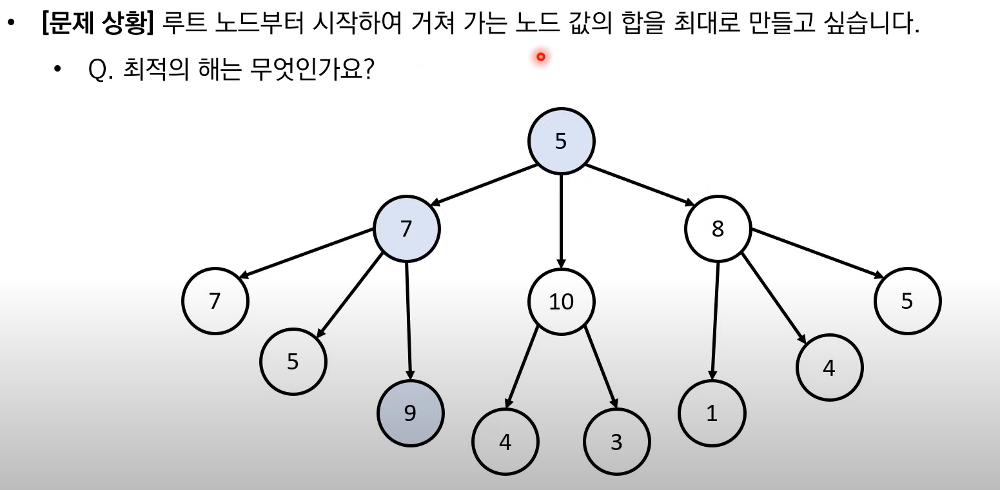
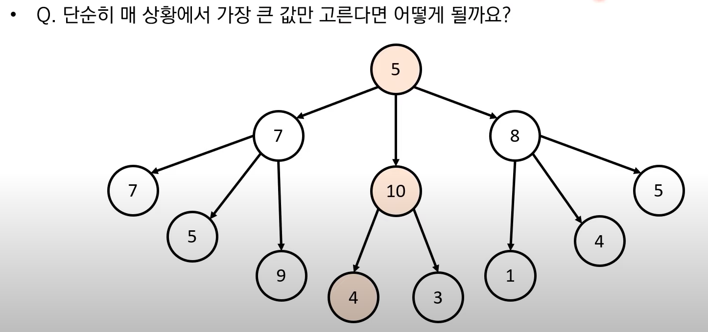
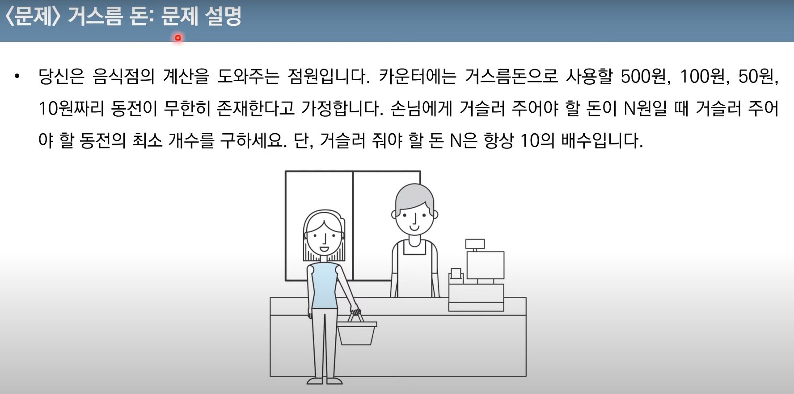
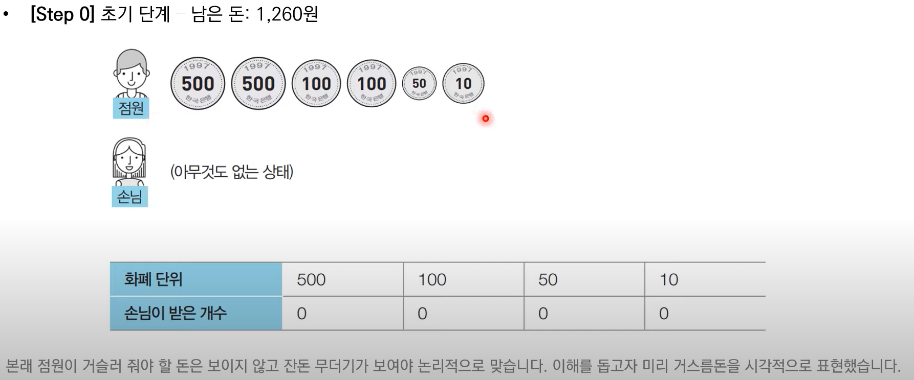

# 그리디 알고리즘(Greedy Algorithm)

## 그리디 알고리즘이란

- 그리디 알고리즘(탐욕법)은 현재 상황에서 지금 당장 좋은 것만 고르는 방법을 의미합니다.
- 일반적인 그리디 알고리즘은 문제를 풀기 위한 최소한의 아이디어를 떠올릴 수 있는 능력을 요구합니다.
- 그리디 해법은 그 정당성 분석이 중요합니다.
    - 단순히 가장 좋아 보이는 것을 반복적으로 선택해도 최적의 해를 구할 수 있는지 검토합니다.




- 일반적인 상황에서 그리디 아고리즘은 최적의 해를 보장할 수 없을 때가 많습니다.
- 하지만 코딩 테스트에서의 대부분의 그리디 문제는 탐요법으로 얻은 해가 최적의 해가 되는 상황에서, 이를 추론할 수 있어야 풀리도록 출제됩니다.

### <문제> 거스름돈



### <문제> 거스름 돈: 문제 해결 아이디어

- 최적의 해를 빠르게 구하기 위해서는 가장 큰 화폐 단위부터 돈을 거슬러 주면 됩니다.
- N원으 ㄹ거슬러 줘야 할 때, 가장 먼저 500원으로 거슬러 줄 수 있을 만큼 거슬러 줍니다.
    - 이후에 100원, 50원, 10원짜리 동전을 차례대로 거슬러 줄 수 있을 만큼 거슬러 주면 됩니다.

- N = 1,260일 때의 예시를 확인해 봅시다.




### <문제> 거스름 돈: 정당성 분석

- 가장 큰 화폐 단위부터 돈을 거슬러 주는 것이 최적의 해를 보장하는 이유는 무엇일까요?
    - 가지고 있는 동전 중에서 큰 단위가 항상 작은 단위의 배수이므로 작은 단위의 동전들을 종합해 다른 해가 나올 수 없기 때문입니다.

- 만약에 800원을 거슬러 주어야 하는데 화폐 단위가 500원, 400원, 100원이라면 어떻게 될까요?
- 그리디 알고리즘 문제에서는 이처럼 문제 풀이를 위한 최소한의 아이디어를 떠올리고 이것이 정당한지 검토할 수 있어야 합니다.

### <문제> 거스름 돈: 시간 복잡도 분석

- 화폐의 종류가 K라고 할 때, 소스코드의 시간 복잡도는 *O(K)* 입니다.
- 이 알고리즘의 시간 복잡도는 거슬러줘야 하는 금액과는 무관하며, 동전의 총 종류에만 영햐을 받습니다.

```c++
#include <bits/stdc++.h>

using namespace std;

int n = 1260
int cnt;

int coinTypes[4] = {500, 100, 50, 10};

int main(void) {
  for (int i = 0; i < 4; i++ {
    cnt += n / coinTypes[i];
    n %= coinTypes[i];
  }
  cout << cnt << '\n';
}
```

```java
public class Main {

  public static void main(String[] args) {
    int n = 1260;
    int cnt = 0;
    int[] coinTypes[] = {500, 400, 100, 50};
    
    for (int i = 0; i < 4; i++) {
      cnt += n / coinTypes[i];
      n %= coinTypes[i];
    }
    
    System.out.println(cnt);
  }
}
```

